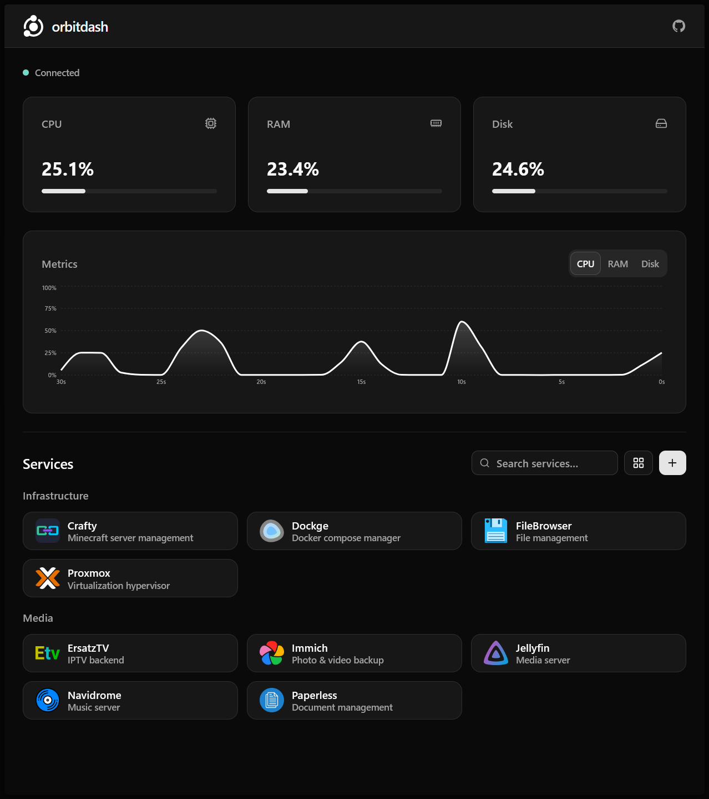

<p align="center">
  
</p>

<p align="center">
  <a href="https://github.com/chriscorbell/orbitdash/actions/workflows/docker-publish.yml?branch=main" target="_blank">
    
  </a>
</p>

<br/>

<p align="center">
  <b>orbitdash</b> is <i>yet another</i> modern server dashboard, <br>inspired by <a href="https://github.com/MauriceNino/dashdot" target="_blank">dashdot</a>, <a href="https://github.com/bastienwirtz/homer" target="_blank">homer</a> and <a href="https://github.com/ajnart/homarr" target="_blank">homarr</a>.
</p>

<p align="center">
  It is intended for use on home/private servers.
</p>

<p align="center">
  Built with TypeScript, React, TailwindCSS, shadcn/ui, Vite, Bun, Hono and SQLite.
</p>

<p align="center">
  <a href="https://github.com/chriscorbell/orbitdash/pkgs/container/orbitdash" target="_blank">Container Image (GHCR)</a>
</p>

## Preview

 

## Features

- Live CPU/RAM/Disk metrics with charts
- Simple service links with icons and categories
- Upload your own PNG/SVG icons, or alternatively enter a URL that points to a PNG/SVG on [dashboardicons.com](https://dashboardicons.com)
- Inline search and filtering
- UI-native service management (no config file needed)
- Toggle between 3-column and 4-column grid for service links

## Quick Install (Docker Run)

```bash
docker run -d \
  --name orbitdash \
  --restart unless-stopped \
  -p 7770:3000 \
  -v orbitdash-data:/data \
  -e ORBITDASH_DATA_DIR=/data \
  ghcr.io/chriscorbell/orbitdash:latest
```

## Quick Install (Docker Compose)

```yaml
services:
  orbitdash:
    container_name: orbitdash
    image: ghcr.io/chriscorbell/orbitdash:latest
    restart: unless-stopped
    ports:
      - "7770:3000" # Change 7770 to whatever port you want to map to
    environment:
      - ORBITDASH_DATA_DIR=/data
    volumes:
      - orbitdash-data:/data

volumes:
  orbitdash-data:
```

## Configuration

Environment variables:

- `PORT` (default: `3000`)
- `ORBITDASH_DATA_DIR` (default: `./data`)

## Data Persistence

All data is stored under `ORBITDASH_DATA_DIR`:

- `orbitdash.db` (SQLite database)
- `icons/` (uploaded/downloaded service icons)

## Contributing

Issues and PRs are welcomed. Please include description, screenshots and any related logs.