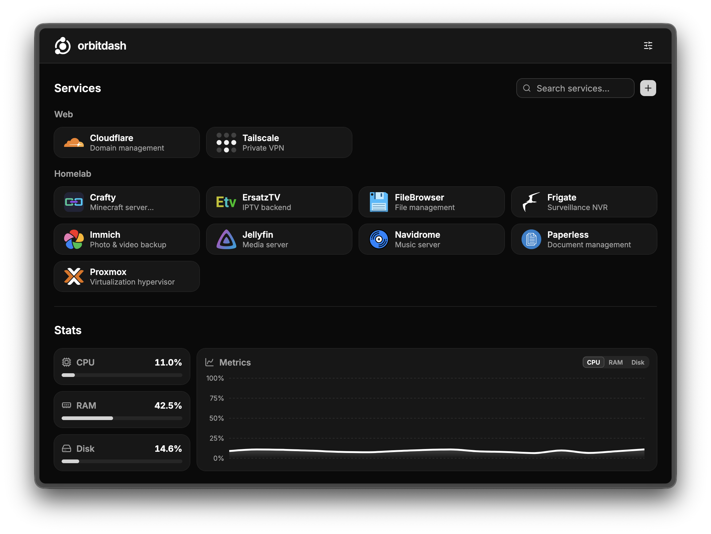

<p align="center">
  
</p>

<p align="center">
  <a href="https://github.com/chriscorbell/orbitdash/actions/workflows/docker-publish.yml?branch=main" target="_blank">
    
  </a>
</p>

<br/>

<p align="center">
  <b>orbitdash</b> is <i>yet another</i> modern server dashboard, <br>inspired by <a href="https://github.com/MauriceNino/dashdot" target="_blank">dashdot</a>, <a href="https://github.com/bastienwirtz/homer" target="_blank">homer</a> and <a href="https://github.com/ajnart/homarr" target="_blank">homarr</a>.
</p>

<p align="center">
  It is intended for use on home/private servers.
</p>

<p align="center">
  Built with TypeScript, React, TailwindCSS, shadcn/ui, Vite, Bun, Hono and SQLite.
</p>

<p align="center">
  <a href="https://github.com/chriscorbell/orbitdash/pkgs/container/orbitdash" target="_blank">Container Image (GHCR)</a>
</p>

Container tags follow three channels:

- `latest` and `main` are rolling tags updated from every validated push to `main`, except
  documentation-only changes.
- `sha-<commit>` identifies the build produced from one Git commit.
- `vX.Y.Z` identifies a stable release whose tag matches the version in `package.json`.

For an immutable deployment or rollback, pin the manifest digest as
`ghcr.io/chriscorbell/orbitdash@sha256:<digest>`; registry tags can be republished.

`package.json` is the single source for stable release versions. Its initial `0.0.0` value means
that no stable release has been cut yet; the first release PR replaces it with the chosen semantic
version before creating the matching tag.

## Preview



## Features

- Live CPU/RAM/Disk metrics with charts
- Simple service links with icons and categories
- Upload your own PNG/SVG icons, or alternatively enter a direct URL to a PNG or SVG icon
- Inline search and filtering
- UI-native service management (no config file needed)
- Toggle between 3-column and 4-column grid for service links
- Reorder category sections with a shared saved layout
- Collapse category sections with saved per-browser state

## Platform Support

- x86_64
- aarch64

## Installation Options

#### Docker Run

```bash
docker run -d \
  --name orbitdash \
  --restart unless-stopped \
  -p 7770:3000 \
  -v ./orbitdash-data:/data \
  ghcr.io/chriscorbell/orbitdash:latest
```

#### Docker Compose

```yaml
services:
  orbitdash:
    container_name: orbitdash
    image: ghcr.io/chriscorbell/orbitdash:latest
    restart: unless-stopped
    ports:
      - "7770:3000"
    volumes:
      - ./orbitdash-data:/data
```

After deployment, the dashboard is accessible at `http://<IP-ADDRESS>:7770`.

Change `7770` in the docker run/compose examples above if you want to serve the dashboard on a different port.

## Data Persistence

All data is stored under `/data` inside the container:

- `orbitdash.db` (SQLite database)
- `icons/` (uploaded/downloaded service icons)

The docker run/compose examples above bind-mount `/data` to `./orbitdash-data` in the current working host directory. You can change this to a different location on the host, or alternatively map to a volume instead if desired.

Outside Docker, orbitdash stores data in `./data` by default. You can override the storage path in any environment with `ORBITDASH_DATA_DIR=/path/to/data`.

For backup and restore steps, including SQLite WAL files and icon assets, see
[docs/backup-restore.md](docs/backup-restore.md).

The backend listens on port `3001` by default outside the container. Override it with `PORT=<port>`.

The disk metric uses `/` by default. Override it with `ORBITDASH_DISK_PATH=/path/to/mount` when you
need to track a different mount.

## Health Checks

- `GET /healthz` returns liveness for process-level checks.
- `GET /readyz` returns readiness for deployment and CI probes, including a SQLite connectivity check.
- `GET /api/health` returns the same readiness payload as `readyz` for API-oriented clients.

## Deployment Verification

After deploying or upgrading the container, verify the service with:

```bash
curl --fail http://127.0.0.1:7770/healthz
curl --fail http://127.0.0.1:7770/readyz
```

Also confirm that:

- the host directory or volume mapped to `/data` is intact
- the expected host port is mapped to container port `3000`
- persisted services and icons still load after the restart

To roll back, resolve the previous `vX.Y.Z` or `sha-<commit>` image to its manifest digest, pin
`ghcr.io/chriscorbell/orbitdash@sha256:<digest>`, restart the container, and repeat the health
checks. Image rollback does not reverse database changes; keep a data backup from before each
upgrade.

## Testing

Use the following commands for the initial automated test workflow:

```bash
npm run test:e2e:install
npm run format
npm run format:check
npm run typecheck
npm run test:unit
npm run test:integration
npm run test:e2e
npm test -- --run
npm run test:coverage
```

Run `npm run test:e2e:install` once per machine before the first browser smoke test so Chromium is
available locally.

Formatting is enforced with Prettier. Use `npm run format` locally to normalize files and
`npm run format:check` to run the same check that CI uses.

The coverage gate reports shared, frontend, and server scopes separately. Shared runtime modules
remain at 100%; focused frontend application code and loaded server production modules use
baseline thresholds derived from their existing behavior tests. See [CONTRIBUTING.md](CONTRIBUTING.md#test-strategy)
for exact scope and thresholds.

## Validation Rules

Shared runtime validation now lives in `shared/schemas.ts` and is used by both the server routes
and the service dialog submit path. The current canonical rules are:

- service names are required after trimming
- service URLs must normalize to valid `http` or `https` URLs
- icon URLs, when provided, must normalize to valid `http` or `https` URLs
- remote icon downloads are limited to 2 MB, time out after 5 seconds, follow at most 3 redirects,
  reject localhost/private literal hosts, and verify the downloaded bytes match a supported image
  format
- category and description fields are trimmed and normalized to `null` when empty
- the `Uncategorized` section cannot be manually included in saved category ordering
- metrics `window` must be a positive integer and is bounded to 3600 seconds

## Contributing

Issues and PRs are welcomed. Please include description, screenshots and any related logs.

For local workflows and project conventions, see [CONTRIBUTING.md](CONTRIBUTING.md),
[docs/architecture.md](docs/architecture.md), and [docs/release-checklist.md](docs/release-checklist.md).
